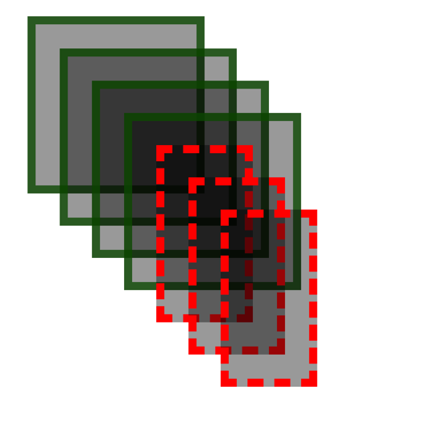
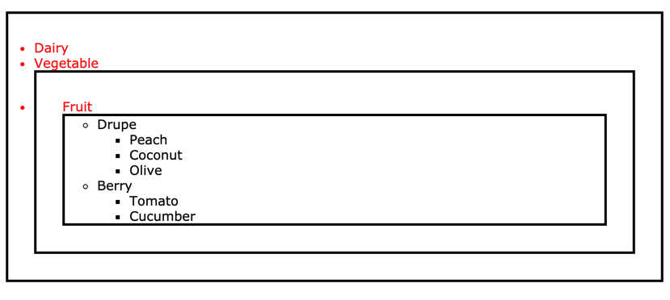

# Cascading and inheritance exercises

### Exercise 1
Edit  files from directory `ex_1`  without changing color values so page will look like this:

### Exercise 2
Write CSS and HTML so browser will display:

### Exercise 3
Write specificity values and tell why 
things looks like they look like

### Exerise 4
Write CSS and HTML using color value only in one selector to achieve this result:

